# Money Scope

Money Scope is a comprehensive Flutter-based mobile application designed to simplify personal finance management. It empowers users to effortlessly track their expenses, gain valuable insights through analytics, and maintain complete control over their financial data.

## Overview

In today's fast-paced world, keeping track of your finances can be a challenge. Money Scope provides a user-friendly and intuitive platform to record your daily expenditures, categorize them for better organization, and visualize your spending patterns. With features like customizable categories, detailed analytics, and timely notifications, Money Scope is your perfect companion for achieving financial clarity and reaching your financial goals.

## Features

*   **Expense Tracking:** Easily add, edit, and delete your daily expenses with a simple and intuitive interface.
*   **Category Management:** Organize your expenses by creating and customizing categories that fit your lifestyle.
*   **Interactive Analytics:** Visualize your spending habits with insightful charts and graphs. Analyze your expenses by category, time period, and more.
*   **Dark & Light Mode:** Seamlessly switch between dark and light themes for a comfortable viewing experience in any lighting condition.
*   **Smart Notifications:** Set up reminders for upcoming bills and recurring payments to avoid late fees.
*   **Data Security:** Your financial data is stored locally on your device to ensure privacy and security.

## Screenshots

### Dark Mode

|                          Home                           |                          Expenses                          |                          Analytics                           |
|:-------------------------------------------------------:|:----------------------------------------------------------:|:------------------------------------------------------------:|
| 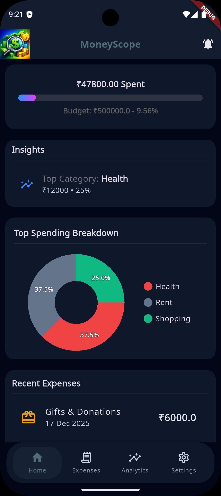 | 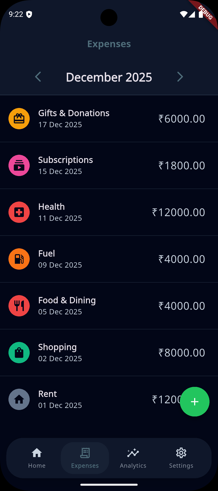 | 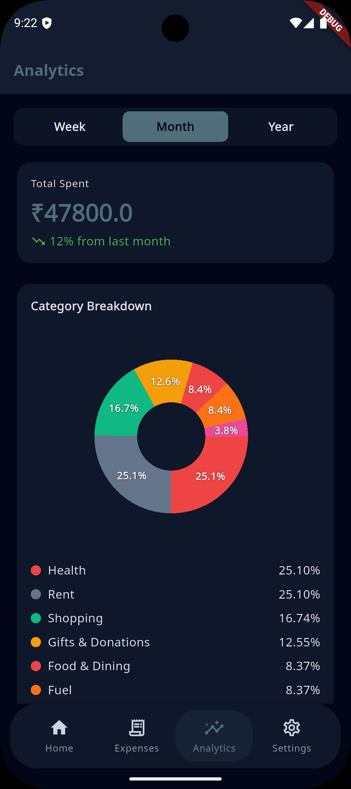 |

|                          Add Expense                           |                          Settings                           |                          Notifications                          |
|:--------------------------------------------------------------:|:-----------------------------------------------------------:|:---------------------------------------------------------------:|
| 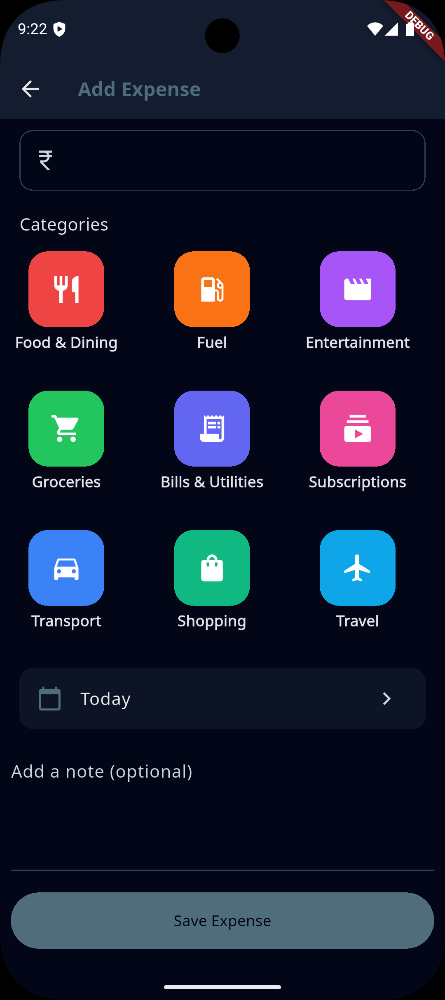 | 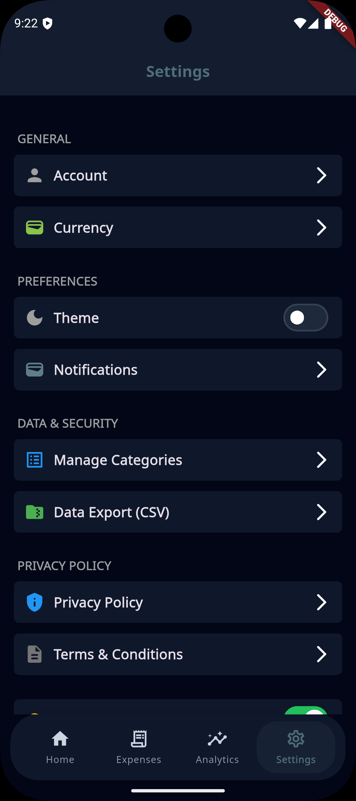 | 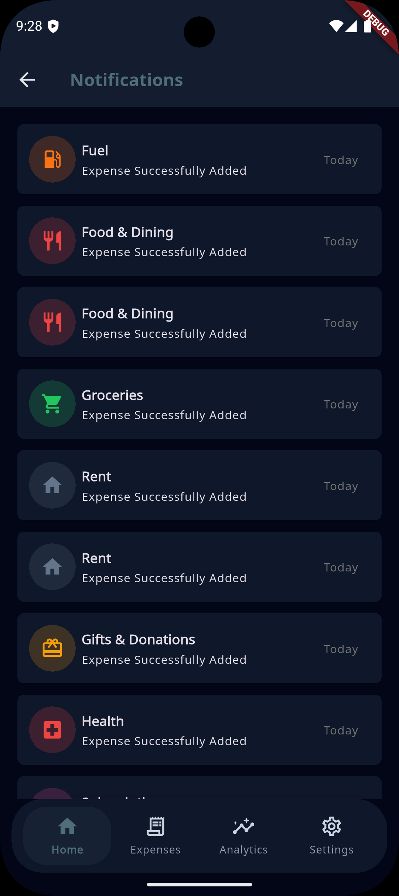 |

### Light Mode

|                           Home                            |                           Expenses                           |                           Analytics                            |
|:---------------------------------------------------------:|:------------------------------------------------------------:|:--------------------------------------------------------------:|
| 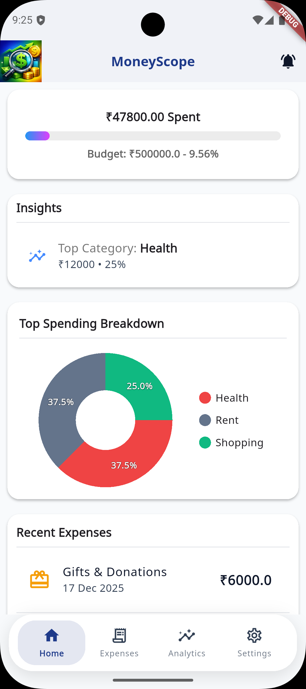 | 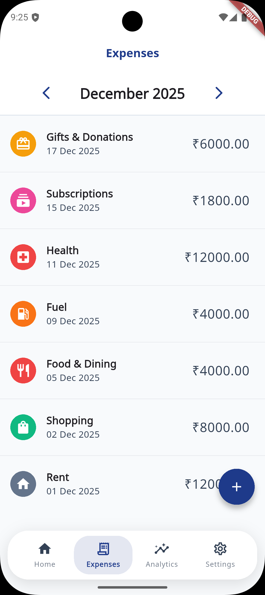 | 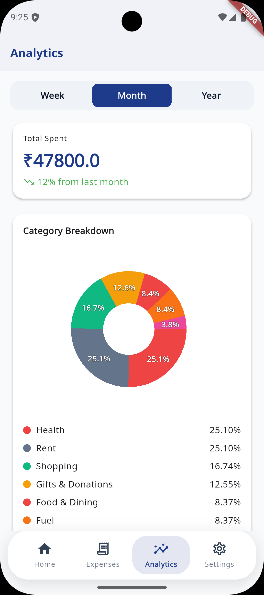 |

|                           Add Expense                            |                           Settings                            |                           Notifications                            |
|:----------------------------------------------------------------:|:-------------------------------------------------------------:|:------------------------------------------------------------------:|
| 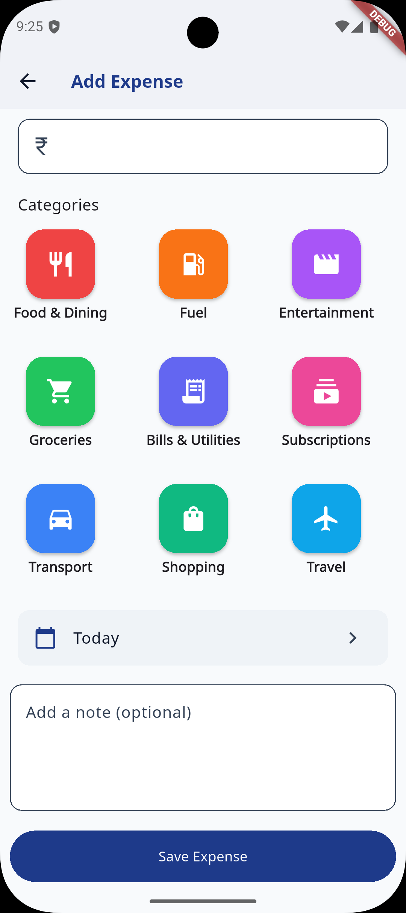 | 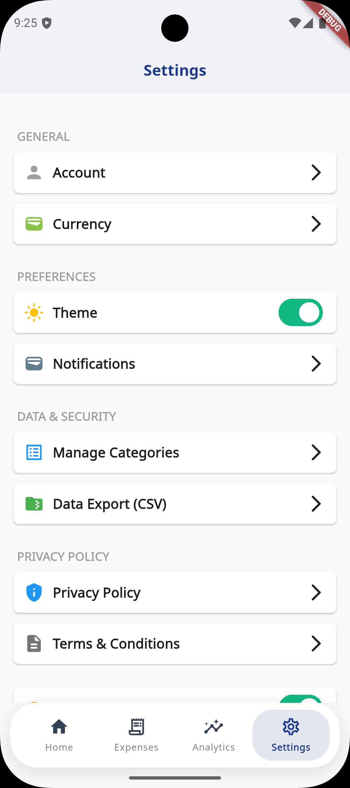 | 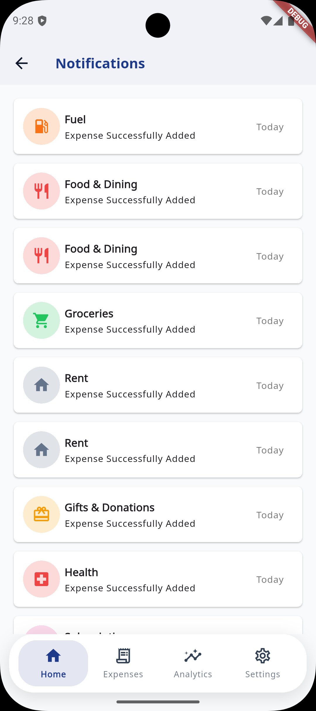 |

## Getting Started

Follow these instructions to get a copy of the project up and running on your local machine for development and testing purposes.

### Prerequisites

*   [Flutter SDK](https://flutter.dev/docs/get-started/install)
*   [Dart SDK](https://dart.dev/get-dart)

### Installation

1.  Clone the repo
    ```sh
    git clone https://github.com/AnkushGaur999/MoneyScope.git
    ```
2.  Install packages
    ```sh
    flutter pub get
    ```
3.  Run the app
    ```sh
    flutter run
    ```

## Contributing

Contributions are what make the open source community such an amazing place to learn, inspire, and create. Any contributions you make are **greatly appreciated**.

If you have a suggestion that would make this better, please fork the repo and create a pull request. You can also simply open an issue with the tag "enhancement".

Don't forget to give the project a star! Thanks again!

1.  Fork the Project
2.  Create your Feature Branch (`git checkout -b feature/AmazingFeature`)
3.  Commit your Changes (`git commit -m 'Add some AmazingFeature'`)
4.  Push to the Branch (`git push origin feature/AmazingFeature`)
5.  Open a Pull Request

## License

Distributed under the MIT License. See `LICENSE` for more information.
